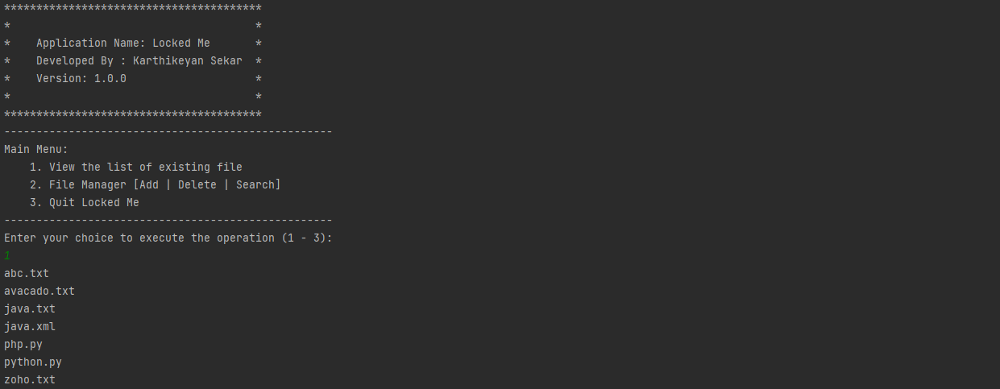

# LockedMe.com Project Documentation

## IDE and SDK Specification

- IDE: IntelliJ IDEA Community Edition
- JAVA SDK: Amazon Corretto version 17.0.5

## GitHub:

- Public repository link: [https://github.com/karthik-sk47/LockedMe.com](https://github.com/karthik-sk47/LockedMe.com)

## Sprint Planning

- **Phase 1:** Create user input console with options to choose generic operation
    - Expected outcome:
        - Display menu with heading “Main Menu” with generic options
            
            1. View the list of existing file
            2. File Manager [Add | Delete | Search]
            3. Quit Locked Me
            
        - Display menu with heading “File Manager Menu” with options to execute business level operations.
            
             1. Add a file
             2. Delete a file
             3. Search for a file
             4. Return to main menu
            
        - Print message based on the user option selected
- **Phase 2:** Implement execution methods for business level operations
    - create methods ***addFile(), searchFile(), deleteFile***
    - Expected outcome: the user must be able to add, delete or lookup a file in the fileStorage directory in the application
- **Phase 3:** Implement execution methods for returning the current file names in ascending order.

## Algorithm:

### **Main Class (Main.java)**

- Main class contains method appSpecification() to print the application details

### **userInteractionConsole Class (userInteractionConsole.java)**

- **displayMainMenu()** - Generic features and three operations:
    - Retrieving the file names in an ascending order
    - Business-level operations **displayFileManagerMenu()** -
        - Option to add a user specified file to the application
        - Option to delete a user specified file from the application
        - Option to search a user specified file from the application
    - Navigation option to close the current execution context and return to the main context
    - Option to close the application
- **userConsole()**
    - Calls functions ***displayMainMenu()*** and ***displayFileManagerMenu()***
    - Switch control flow to handle the operations based on user’s specified input.

### **Business Level Operations handler Class - (BusinessLevelOperation.java)**

- **addFile()** - adds user specified file to fileStorage directory within the application.
    - Uses ***createNewFile()*** method from class **File.**
    - Exception handling used - **IOException.**
- **deleteFile()** - deletes user specified file to fileStorage directory within the application.
    - Uses ***delete()*** method from class **File.**
- **searchFile()** - search for the existence of user specified file in fileStorage directory within the application.
    - Uses linear search algorithm to compare the user specified file name with elements in the list of files existing in the fileStorage directory.

### File viewer class (fileViewer.java)

- **getFilesList()**
    - retrieves list of files in the fileStorage directory in the application.
    - use ***Collections.sort()*** to sort the files in ascending order.
    - prints the list of files that exists.

## Core Concepts Used

- File Handling - for creating and deleting file
- Linear Search Algorithm
- Data Structure - Array, List and Collections
- Control flow - using switch, if-else, do-while methodologies
- Scanner class for scanning user specified inputs
- Exception handling - FileNotFoundException, IOException
- Encapsulation in OOPS

## Source Code

**Class Main.java**

```java
package com.LockedMe;

import java.io.FileNotFoundException;
import java.util.Scanner;

public class Main {

    public static void appSpecification(){
        System.out.println("****************************************");
        System.out.println("*                                      *");
        System.out.println("*    Application Name: Locked Me       *");
        System.out.println("*    Developed By : Karthikeyan Sekar  *");
        System.out.println("*    Version: 1.0.0                    *");
        System.out.println("*                                      *");
        System.out.println("****************************************");
    }
    public static void main(String args[]){

        appSpecification();

        userInteractionConsole userConsole = new userInteractionConsole();

        try {
            userConsole.userConsole();
        } catch (FileNotFoundException e) {
            e.printStackTrace();
        }

    }
}
```

Class userInteractionConsole.java

```java
package com.LockedMe;

import java.io.FileNotFoundException;
import java.util.Scanner;

public class userInteractionConsole {

    private static void displayMainMenu(){
        System.out.println("---------------------------------------------------");
        System.out.println("Main Menu:");
        System.out.println("\t1. View the list of existing file");
        System.out.println("\t2. File Manager [Add | Delete | Search]");
        System.out.println("\t3. Quit Locked Me");
        System.out.println("---------------------------------------------------");
        System.out.println("Enter your choice to execute the operation (1 - 3): ");
    }

    private static void displayFileManagerMenu(){
        System.out.println("---------------------------------------------------");
        System.out.println("File Manager Menu:");
        System.out.println("\t1. Add a file");
        System.out.println("\t2. Delete a file");
        System.out.println("\t3. Search for a file");
        System.out.println("\t4. Return to main menu");
        System.out.println("---------------------------------------------------");
        System.out.println("Enter your choice to execute the operation (1 - 4): ");
    }

    public static void userConsole() throws FileNotFoundException {

        Scanner scanInput = new Scanner(System.in);
        int userChoise;

        do {
            displayMainMenu();
            userChoise = scanInput.nextInt();
            switch(userChoise){
                case 1:
                    filesViewer view = new filesViewer();
                    view.getFilesList();
                    break;
                case 2:
                    int subChoise;

                    do {
                        displayFileManagerMenu();
                        subChoise = scanInput.nextInt();
                        BusinessLevelOperation ops = new BusinessLevelOperation();
                        switch (subChoise) {
                            case 1:
                                ops.addFile();
                                break;
                            case 2:
                                ops.deleteFile();
                                break;
                            case 3:
                                ops.searchFile();
                                break;
                            case 4:
                                System.out.println("Return to Main Menu");
                                break;
                            default:
                                System.out.println("Invalid Input Retry");
                        }
                    }while(subChoise!=4);
                    break;
                case 3:
                    System.out.println("Exit Application");
                    break;
                default:
                    System.out.println("Invalid Input Retry");
            }
        }while(userChoise!=3);

    }
}
```

**Class fileViewer.java**

```java
package com.LockedMe;

import java.io.File;
import java.util.ArrayList;
import java.util.Collections;
import java.util.List;

public class filesViewer {
    private List<String> filesList= new ArrayList<String>();
    private String userDirectory = System.getProperty("user.dir") + "\\fileStorage\\";
    private File[] files = new File(userDirectory).listFiles();

    public void getFilesList() {
        for(File file : files) {
            if(file.isFile()) {
                filesList.add(file.getName());
            }
        }
        Collections.sort(filesList);
        filesList.forEach(System.out::println);

    }
}
```

**Class BusinessLevelOperation.java**

```java
package com.LockedMe;

import java.io.File;
import java.io.IOException;
import java.util.Scanner;

public class BusinessLevelOperation {

    private  String userDirectory = System.getProperty("user.dir")+ "\\fileStorage\\";
    public void addFile() {

        System.out.println("Enter the file which you wish to add:");
        Scanner scan = new Scanner(System.in);

        String fileName = scan.nextLine();
        File fileObject = new File(userDirectory+ fileName);
        try {
            if(fileObject.createNewFile()) {
                System.out.println(fileName + " file is added to the directory");
            }
            else {
                System.out.println("This file is already exists");
            }
        } catch (IOException e) {
            e.printStackTrace();
        }

    }

    public void deleteFile() {
        System.out.println("Enter the file name you wish to delete:");
        Scanner scan=new Scanner(System.in);
        String fileName = scan.nextLine();

        File F= new File(userDirectory + fileName);
        if(F.delete())
            System.out.println(fileName + " is Deleted!");
        else
            System.out.println("File Not Found");
    }

    public void searchFile() {
            Scanner scan= new Scanner(System.in);
            File directory = new File(userDirectory);
            System.out.println("Enter the file name you need to lookup:");
            String fileName=scan.nextLine();
            String[] files=directory.list();
            int flag=0;
            for (String file : files) {
                if (file.equals(fileName)) {
                    flag=1;
                    System.out.println(file + " File found");
                }
            }
            if(flag==0) {
                System.out.println("File not found");
            }

    }
}
```

## Output Snapshots

### Output 1 (Retrieving the file names in an ascending order):



### Output 2(a) (Business-level operations - add a user specified file to the application):


### Output 2(b) (Business-level operations - add a user specified file to the application):


### Output 3 (Business-level operations - delete a user specified file from the application):


### Output 4 (Business-level operations - search a user specified file from the application):


### Output 5 (Business-level operations - Navigation option to close the current execution context and return to the main context)


### Output 6 (Exiting Application)


## Conclusion:

This file manager application enable users to view, add, search and delete file from the directory. this can be enhanced for file reading and editing.